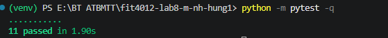
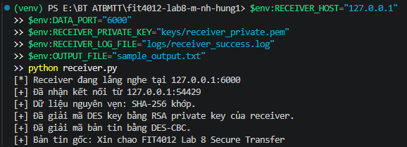
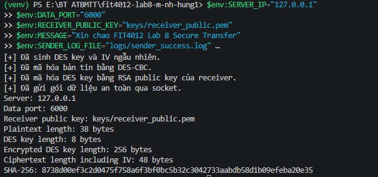

# Lab 8 - Báo cáo 1 trang

## 1. Mục tiêu

Xây dựng chương trình truyền dữ liệu an toàn qua socket bằng cách kết hợp DES-CBC, SHA-256 và RSA-OAEP.

## 2. Luồng xử lý Sender

1. Đọc plaintext từ biến môi trường `MESSAGE`, file `INPUT_FILE` hoặc bàn phím.
2. Tính SHA-256 của plaintext gốc.
3. Sinh ngẫu nhiên DES key 8 byte và IV 8 byte.
4. Mã hóa plaintext bằng DES-CBC, đặt IV ở đầu ciphertext.
5. Mã hóa DES key bằng RSA public key của Receiver.
6. Gửi packet qua socket theo định dạng Lab 8.

## 3. Luồng xử lý Receiver

1. Nhận packet qua socket.
2. Tách encrypted DES key, ciphertext và SHA-256 hash.
3. Dùng RSA private key để giải mã DES key.
4. Dùng DES key để giải mã ciphertext.
5. Tính lại SHA-256 của plaintext nhận được.
6. So sánh hash để kết luận dữ liệu nguyên vẹn hay đã bị thay đổi.

## 4. Kết quả minh chứng

- Ảnh chụp màn hình Sender: TODO_SCREENSHOT_SENDER
- Ảnh chụp màn hình Receiver: TODO_SCREENSHOT_RECEIVER
- File log Sender: `logs/sender_success.log`
- File log Receiver: `logs/receiver_success.log`

## 5. Nhận xét

Cơ chế RSA-OAEP giúp bảo vệ khóa DES khi truyền qua mạng. SHA-256 giúp Receiver phát hiện thay đổi trên dữ liệu sau khi giải mã. Tuy nhiên, DES không còn phù hợp cho hệ thống thật; hướng nâng cấp nên là AES-GCM hoặc AES-CBC kết hợp cơ chế xác thực mạnh hơn.

## 6. Trả lời câu hỏi mở rộng

**Q1. [cite_start]Thay DES bằng AES** [cite: 585-593]
- [cite_start]**AES-128** sử dụng kích thước khóa (key) là 16 byte[cite: 589].
- [cite_start]**AES-256** sử dụng kích thước khóa là 32 byte[cite: 590].
- [cite_start]Nếu sử dụng chế độ **AES-CBC**, kích thước vector khởi tạo (IV) cần dùng là 16 byte[cite: 591].
- [cite_start]**Lý do AES-GCM tốt hơn:** Khác với chế độ CBC thông thường phải tính toán hàm băm rời rạc (như SHA-256), chế độ AES-GCM tích hợp sẵn cả khả năng mã hóa nội dung và cơ chế xác thực dữ liệu thông qua *Authentication Tag*[cite: 592]. [cite_start]Điều này giúp hệ thống gọn nhẹ hơn và giảm thiểu rủi ro lập trình viên quên bước kiểm tra tính toàn vẹn (integrity check)[cite: 593].

**Q2. [cite_start]Thêm chữ ký số cho Sender** [cite: 594-604]
[cite_start]Hiện tại hệ thống chỉ mới bảo mật được khóa và nội dung, nhưng chưa chứng minh được Sender là ai[cite: 595]. Để giải quyết:
- [cite_start]Cấp cho Sender một cặp khóa RSA riêng (Private/Public Key)[cite: 598].
- [cite_start]Sau khi đóng gói dữ liệu (Encrypted DES key + Ciphertext + Hash), Sender sẽ tính mã hash của toàn bộ cục dữ liệu này và dùng Private Key của chính mình để "ký" (mã hóa) lên đó[cite: 599, 600, 601].
- [cite_start]Gói tin gửi đi sẽ đính kèm chữ ký số này[cite: 602].
- [cite_start]Khi Receiver nhận được, sẽ dùng Public Key của Sender để xác minh chữ ký[cite: 603]. [cite_start]Nếu khớp, Receiver chắc chắn 100% gói tin đến từ đúng Sender mong đợi và không bị kẻ gian giả mạo trên đường truyền[cite: 604].

